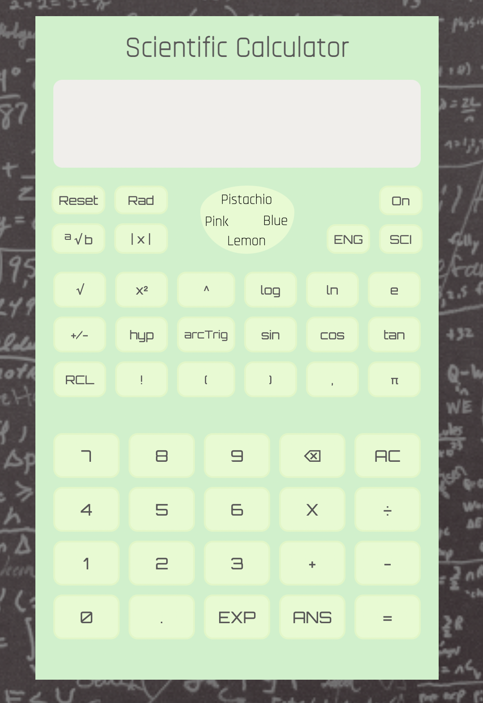

# Calculator

Get your math homework out and start calculating! This project was used as a cumulative review for HTML, CSS & js. Instead of making a normal calculator, I wanted to 
challenge myself and take it one step further by creating a scientific calculator. It is capable of computing basic operations, trigonometric functions, logarithmic 
functions, hyperbolic functions, converting between radian and degree and root functions. 

It was a tall order for a beginner like me but I was able to complete it by taking it step by step. This is the final project of TOP Fundamentals. 

Side Note: This calculator is not perfect since the parenthesis and RCL buttons are non-functional as of now but I hope to fix this in the future. I will 
also try to fix other bugs if I find them. 

# What I Learned
* Targeting a group of buttons to add an event listener 
* Implementing keyboard support 
* A more effiecent way of adjusting the page for mobile devices using the scale feature in CSS 
* Working with toggle functions

# How To Use (Key Notes) 
This calculator works like a regular one but a few things to keep in mind are: 

* Chaining operations: make sure to click the equal sign first so your answer can be added to the storage variable before doing the next operation. 
* Hyperbolic Inverse Trigonometric Functions: Buttons need to be pressed in this order: 
  - "Hyp" -> "arcTrig" -> (trig function desired)
* Keyboard Support is available for 0-9, basic operators, backspace, and equal buttons

# Preview 

# Demo 
🕹 [Calculator](https://bubblegumloco.github.io/calculator/)
